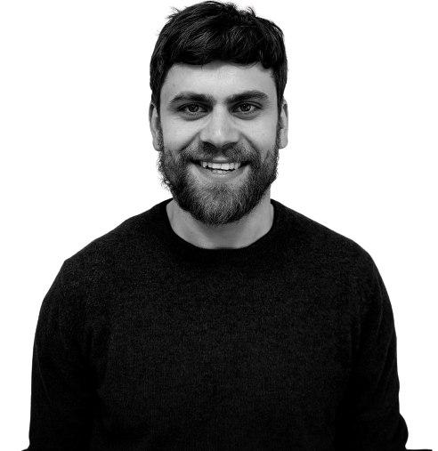

<h2>
      Hei!👋 Jeg heter Håvard og er front-end utvikler.
</h2>      

      Er for tiden deltaker i Kodehode, hvor vi mesteparten av
      kurset har jobbet med frontend utvikling og backend nå i innspurten, 
      noe som virker veldig spennende, og jeg vil fordype meg mer i.  
      De siste 6 månedene har jeg forbedret i meg alt fra Figma til HTML, 
      CSS, Git, JS, TS, React, og nå i innspurten av kurset: node, express, 
      MongoDB og SQL. React er mitt ess i ermet, og MERN-stacken virker da veldig interessant for meg.  
      Ta en titt på mine GitHub-prosjekter for å se hvordan jeg har implementert disse teknologiene.

      

<!--
**havardekodehode/havardekodehode** is a ✨ _special_ ✨ repository because its `README.md` (this file) appears on your GitHub profile.

      

        🔭 Jobber for tiden med en full-stack app i node.js hvor du får film/serie anbefalinger 
        🌱 Fordyper meg i  Node.js, Express, MongoDB for tiden 
        💬 &!^~ google, ask me 
        📫 How to reach me: <a href="mailto:havardeinarsen@gmail.com">havardeinarsen@gmail.com</a>
      

    Here are some ideas to get you started:

    -   🔭 I’m currently working on a full stack application, to use my newly aquired skills
    -   🌱 I’m currently learning Node.js, express, mongodb atm.
    -   👯 I’m looking to collaborate on rad projects😎
    -   🤔 I’m looking for help with alot while i manouver the storm of bugs i encounter
    -   💬 Ask me about flex 💪
    -   📫 How to reach me: havardeinarsen@gmail.com
    -   ⚡ Fun fact: I often have nightmares about public static void main(string args[])

    

    
    Hei!👋 Jeg heter Håvard og er front-end utvikler.
    

      
    Er for tiden deltager i Kodehode, hvor vi mesteparten av kurset har jobbet med frontend utvikling og hvor vi nå i innspurten jobber med backend, noe jeg syntes virker veldig spennende, og noe jeg gjerne vil fordype meg mer i.

    Som deltager på Kodehode, har jeg iløpet av de siste 6 månedene dyppet tærne mine i Figma, HTML, CSS, Git, JS, TS, React, og nå i innspurten node, express, MongoDB og SQL. Jeg føler meg stødig med disse verktøyene og du kan se hvordan jeg har løst problemer på mine prosjekter i Github.

    Gi meg en lyd hvis dette virker interessant. Takk for interessen.

     

-->
